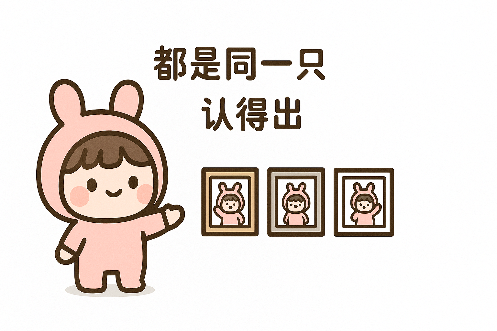
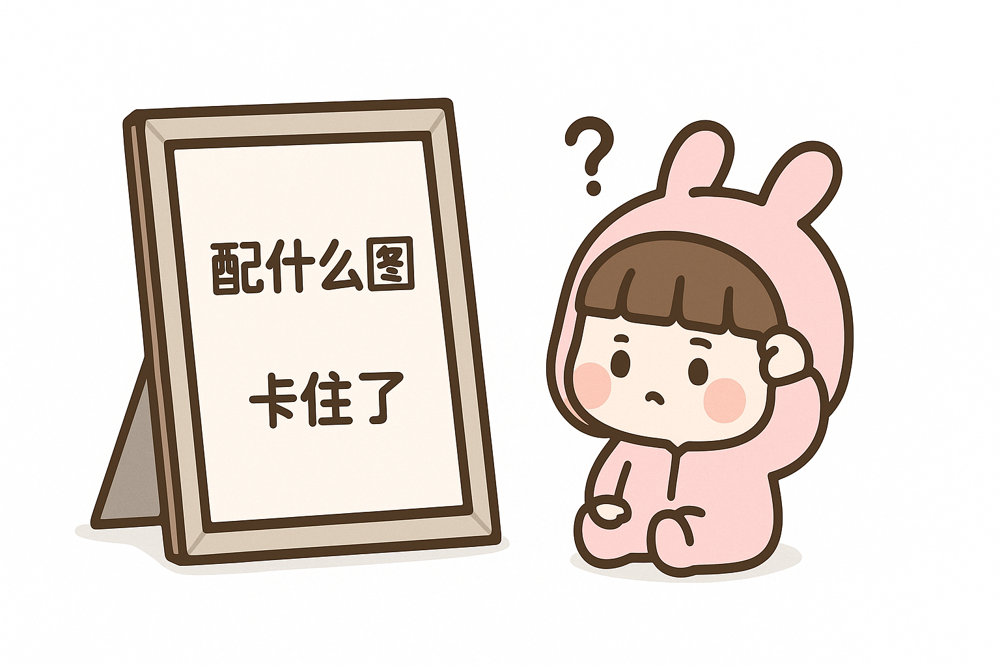
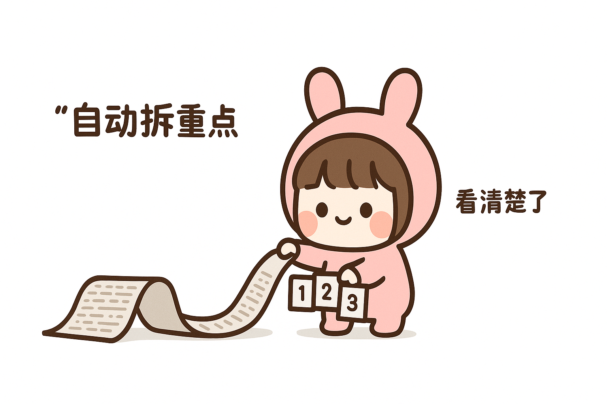
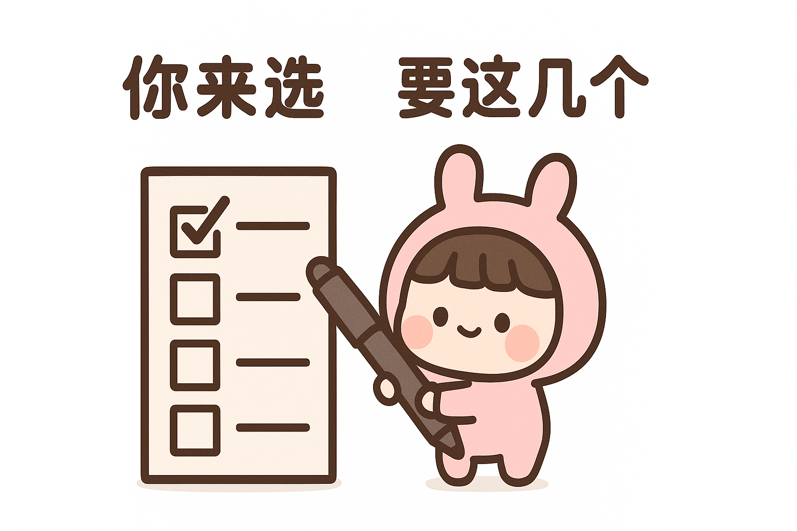
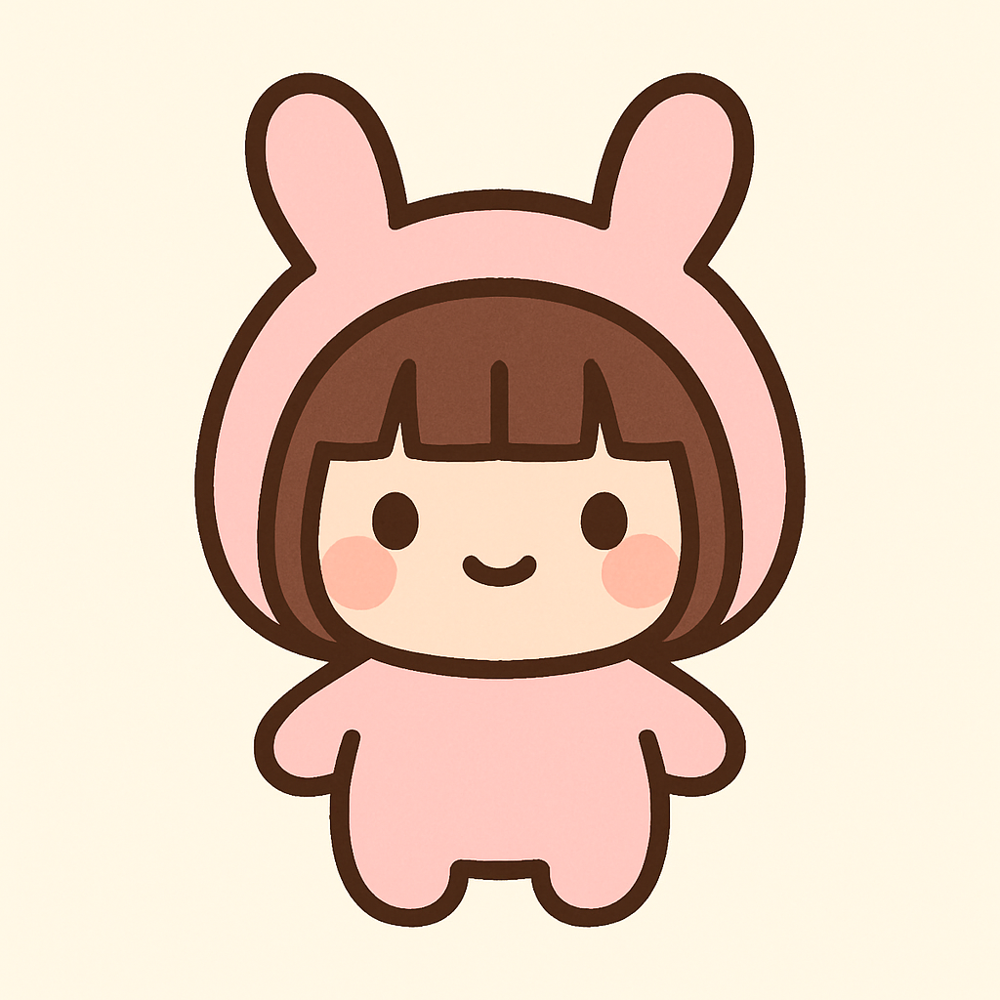
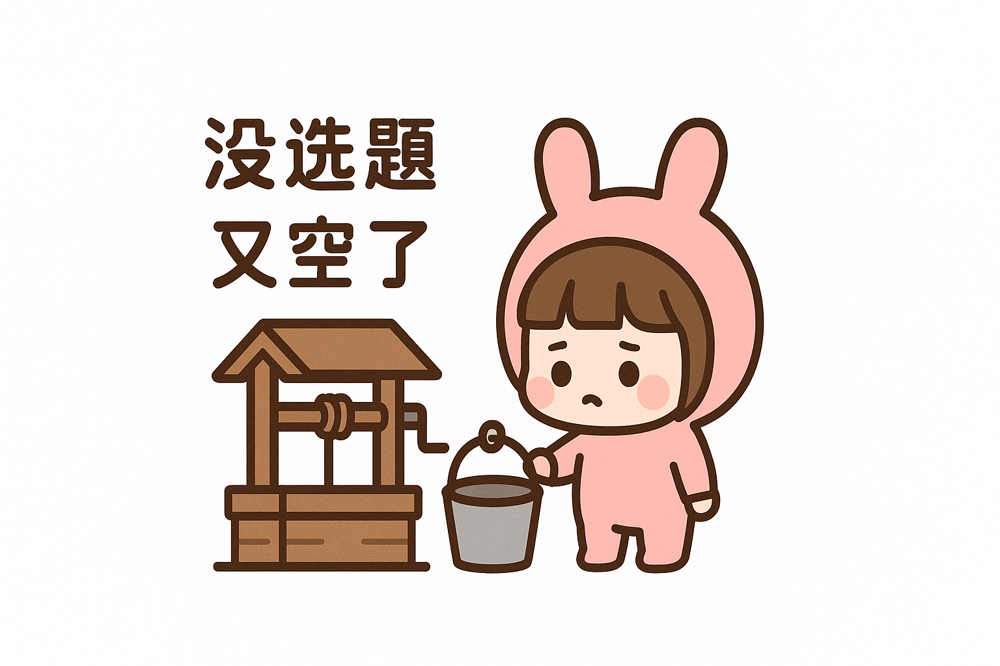
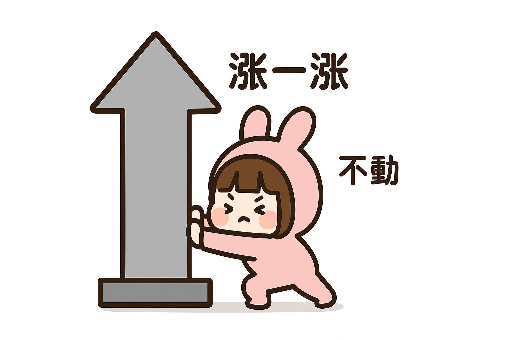
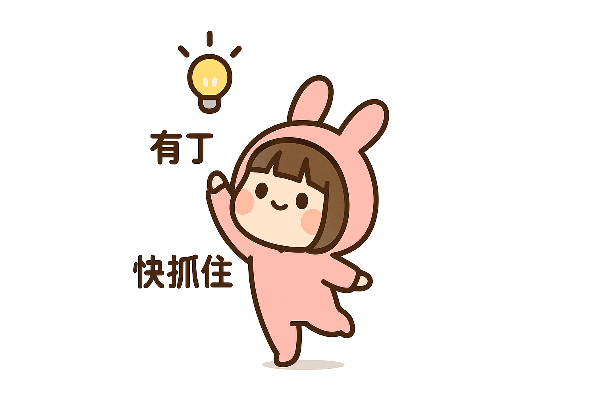
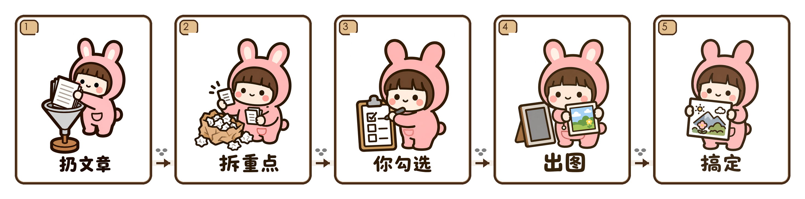
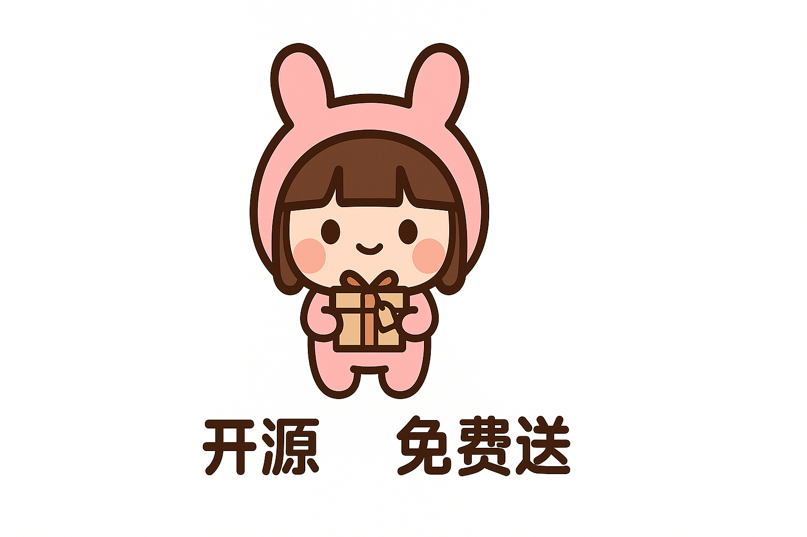

# 张三岁配图 · zhangsansui-peitu

> 你扔一篇文章进去，它帮你**拆重点**、再配成**专属张三岁插画**。
>
> 纯文字内核 · 不蹭作者账号/额度 · 配你自己的文生图工具用 · Claude / Codex Skill

<p align="center">
  
  
</p>

---

## 写内容的人，一半时间卡在配图



正文写完，你还得回头想：这篇该配几张图？配在哪几段？画什么才不尴尬？翻图库、刷 AI，半天过去，图还是"差点意思"——而且**每一张都不是你**，读者划过去一点印象都留不下。

张三岁配图就是来解决这一步的。它不是又一个"输入关键词出图"的工具，它先**读懂你的文章**，再帮你配图。

<br clear="all">

## 它怎么工作：四步

**1. 你把整篇文章丢给它。** 不用自己想配图方案。

**2. 它自动读完，归纳出这篇值得配图的几个重点，列清单给你。**
这是最关键的一步——它把"哪几段适合配图、各自是什么处境"列出来，你一眼看清整篇的配图结构，而不是对着全文瞎猜。

**3. 你勾选要哪几个。** 全要、只要三个、自己再补一个，都行。它不替你拍板。

**4. 它把选中的每个重点，画成一张配图。** 同一个风格、同一个角色。

<p align="center">
  
  
</p>

一句话：**它把"配图"这件模糊的事，拆成了"先看清结构、再按需出图"。**

---

## 张三岁是谁



一只圆滚滚的小团子，戴粉色兔耳连帽、棕色齐刘海、两颗黑豆眼加腮红。简单，但见过一次就记得住。

本开源版用 **🔒 文字内核** 定义她——5 个任何文生图模型都能复现的核心特征：

| # | 特征 |
| --- | --- |
| 1 | 团子比例（大头小圆身、短粗四肢） |
| 2 | 粉色兔耳连帽（两只立起圆兔耳） |
| 3 | 棕色齐刘海（帽檐下露出框脸） |
| 4 | 极简脸（黑豆眼 + 粉腮红 + 小弧嘴） |
| 5 | 粗深褐描边 + 平涂 + 纯白底 |

把这 5 条写进任意文生图工具的提示词，就能得到认得出的张三岁。

<br clear="all">

## 为什么这样画：真实物件 + 物理动作

每张图都遵循一个公式：**张三岁 + 一个真实物件 + 一个物理动作 + 几个短标签**。

比如"没选题了"，画成她从井里吊上来一个空桶；"加班赶 deadline"，画成她顶着快漏完的沙漏较劲；"发不发这篇"，画成手悬在发布按钮上方不敢按。**把抽象的情绪变成看得见的动作**，读者一秒就懂"这说的就是我"。

纯白背景、大量留白、不堆元素、不写大段字。轻、干净，不是 PPT 信息图。

## 为什么值得用：认得出

普通 AI 配图最大的问题是**没有连续性**——今天一个小人，明天另一个小人，读者记不住。张三岁有一套被锁死的识别特征，配一百篇文章、画一百个场景，**她始终是同一只**。你的内容因此有了一张固定的脸。

### 示例母版

下面 6 张是质量标尺。学它们的比例、留白、真实物件质感、张三岁动作和叙事关系，**不要机械复刻**构图。

| 选题枯竭 | 废稿堆 | 数据不涨 |
| :---: | :---: | :---: |
|  |  |  |
| **赶 DDL** | **灵感突现** | **纠结发布** |
|  |  |  |

### 格子长条

如果文章是教程、流程、复盘、日记、周记或成长记录，也可以做成一条从左到右的格子长条：每格一个动作，用脚印和箭头串起来，读者一眼看懂"先做什么、再发生什么、最后留下什么"。

<p align="center">
  
</p>

---

## 安装

### Claude Code

```bash
git clone https://github.com/335678296-creator/zhangsansui-peitu.git
cp -R zhangsansui-peitu/zhangsansui-peitu ~/.claude/skills/
```

### Codex

```bash
mkdir -p "${CODEX_HOME:-$HOME/.codex}/skills"
cp -R zhangsansui-peitu/zhangsansui-peitu "${CODEX_HOME:-$HOME/.codex}/skills/"
```

## 怎么用

对它说人话 + 贴文章：

```text
用 zhangsansui-peitu，把下面这篇文章配 4 张图。
<粘贴文章>
```

它会先**列出这篇的可配图重点问你要哪几个**，你勾选后，按你的情况走两种出图模式之一：

### 模式 A · 自动出图（推荐，需你自己的 OpenAI key）

填上**你自己的** key，它就像作者私有版一样一键到底：读文章 → 拆重点 → 你确认 → **图自动生成**。

把你的 key 设置到 `OPENAI_API_KEY` 环境变量，或写入仓库外的 `~/.zhangsansui-peitu.key`。

之后直接说「用 zhangsansui-peitu 把这篇配 4 张图」，它会自动调随附的 `scripts/generate.py` 出图。**用的是你自己的 key、你自己的额度，跟作者无关。**

### 模式 B · 手动出图（零配置，任何工具）

不想配 key，就用默认模式：它给你每张的**内核 prompt**，你复制去任何文生图工具（gpt-image / Nano Banana / 即梦 / SD / Midjourney…）自己生。

> **说明：** Skill 这一步（读文章、拆重点、写 prompt、把控风格）永远免费、不碰任何账号。真正出图这一步需要一个图像模型——要么填你自己的 key 让它自动跑（A），要么你拿 prompt 去自己的工具生（B）。**两种都不花作者一分钱，仓库里也没有任何 key。** 没有"凭空出图"这回事。

---

## 两个版本



- **开源版（本仓库）**：张三岁「文字内核」（5 特征），纯文字可复现，零 key，谁都能用。
- **满配版**：作者私有，角色细节拉满（帽顶兔脸、爱心发夹、肚子小熊 logo），用参考图锁住全部样子。不在开源范围内。

开源版**不含**满配版的专属细节——那些靠纯文字复现不稳，强加反而画歪。

<br clear="all">

---

## 致敬

方法论致敬 [Ian Xiaohei Scenes](https://github.com/helloianneo/ian-xiaohei-scenes)。本项目把固定 IP 从"小黑"换成"张三岁"，并针对可爱角色重做了形变与配色规则（保持完整形态、张三岁的粉是画面唯一暖色焦点、真实物件压中性色）。

## License

MIT License（见 [LICENSE](LICENSE)）。张三岁角色形象著作权归作者所有；本仓库授权的是 Skill 方法论与内核定义的使用。
